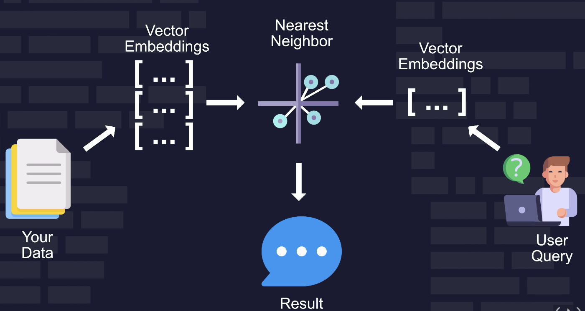
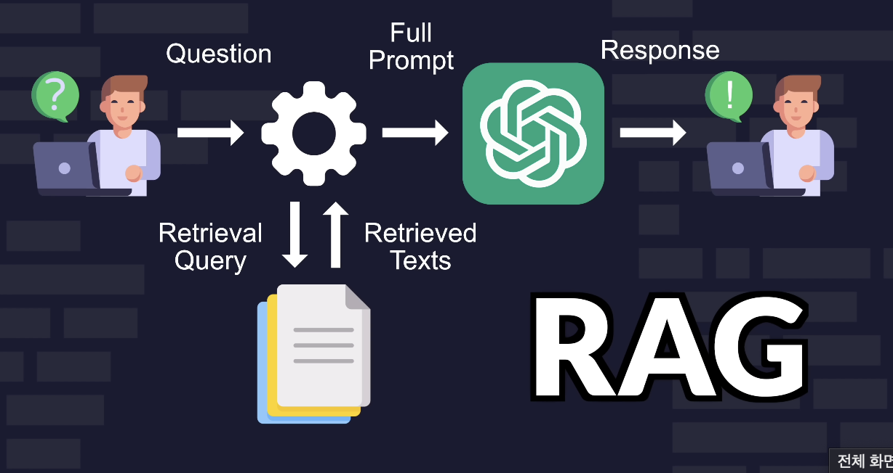

# Vector Search RAG(Retrieval Augmented Generation) Tutorial

Learn how to use vector search and embeddings to easily combine your data with large language models like GPT-4.    
You will first learn the concepts and then create three projects.     




```
pip install pymongo
```


## Project 1: Semantic search for movie recommendations


## Project 2: RAG with Atlas Vector Search, LangChain, OpenAI

#### LLM Limitations
- Hallucinations
- Static data set
- No local data
- Token limit




## Reference     
- [Vector Search RAG Tutorial](https://www.youtube.com/watch?v=JEBDfGqrAUA)